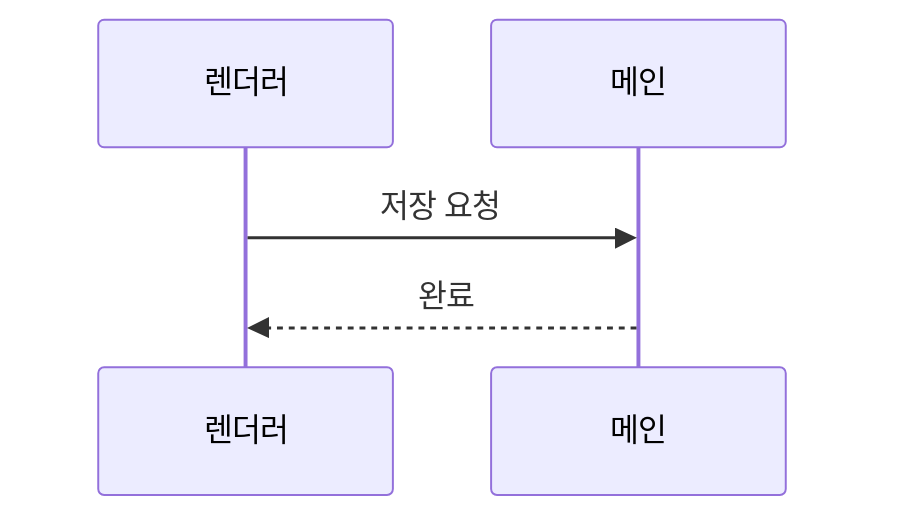

# 표본 핸드북

한글 본문이다. 근거 뱃지는 코드 handler.ts:42 처럼 쓴다.

<figure>
<svg viewBox="0 0 320 90" role="img" aria-label="렌더러와 메인 프로세스">
  <rect class="hb-box" x="10" y="20" width="120" height="50" rx="4"/>

  <text class="hb-t" x="70" y="50" text-anchor="middle">렌더러</text>
  <rect class="hb-box" x="190" y="20" width="120" height="50" rx="4"/>
  <text class="hb-t" x="250" y="50" text-anchor="middle">메인</text>
  <line class="hb-arrow" x1="130" y1="45" x2="188" y2="45"/>
  <text class="hb-t-s" x="159" y="38" text-anchor="middle">IPC</text>
</svg>
<figcaption>렌더러는 파일에 직접 접근하지 않고 IPC 로만 메인에 요청한다.</figcaption>
</figure>
